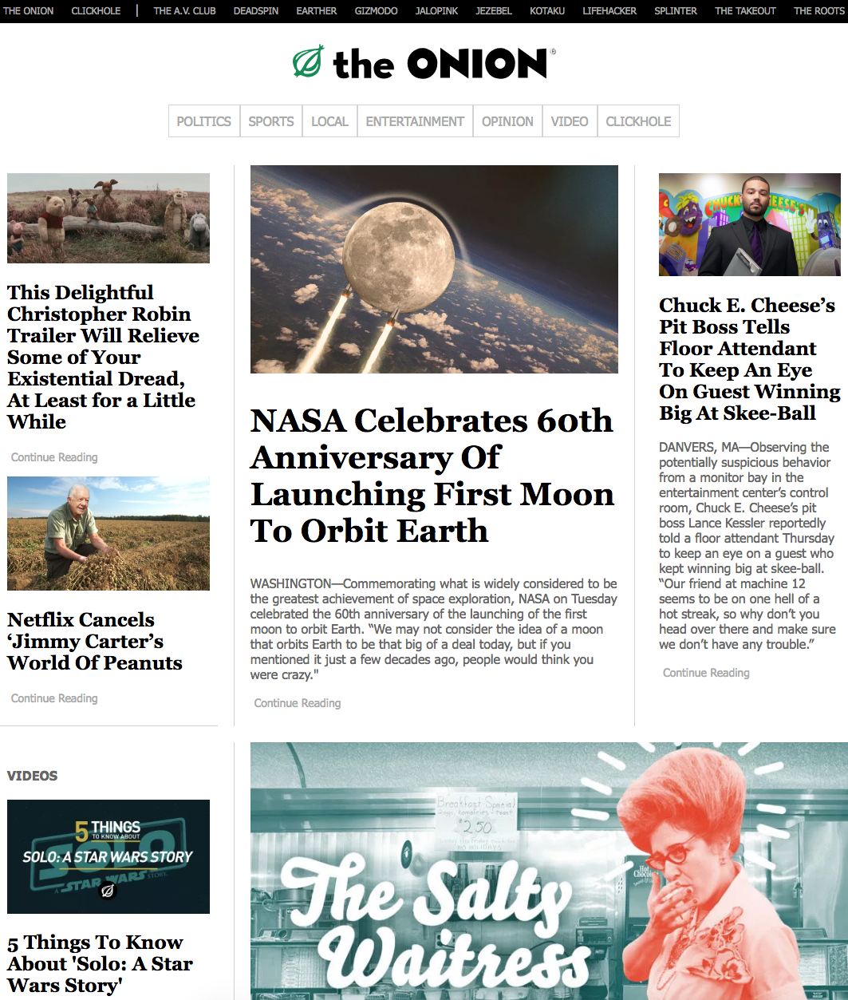

# The Onion
##### Clone of The Onion Home page
The Onion is an online satirical news website. This project is a clone of the home page using css grids and flexbox to create the content layout. This website also includes media queries to view on a variety of devices with different screen sizes.
## The Real Webite

## The Clone

## Installation
* Clone project folder in terminal: `$ git clone` repository url
* In terminal, run `$ npm install` within project folder home directory
* In terminal, run `$ npm start` to view in browser

## Known Bugs
No Bugs
## Contact
Contact me through github with comments/questions.
## Technologies Used
* HTML
* CSS
* Node/Webpack

### License
Copyright (c) 2018 **_Robin Sola_**
